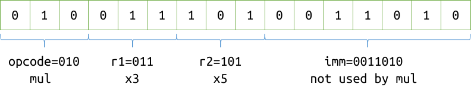

# Problem 1. Basic knowledge

1. Suppose `c` is a variable of type `char`. If `c` is a decimal digit character, how can we obtain its numeric value?

- `int(c)`
- `c - 48`
- `c - '0'`
- `c - '\0'`
- `*(int *)&c`

2. Regarding **undefined behaviors**, which of the following statements is/are true?

- An undefined behavior results in one of a set of valid results. For example, the following code (assuming `int` is 32-bit) will assign the variable `x` with some value, but the value is not valid.

  ```c
  int ival = 10000000;
  int x = ival * ival;
  ```

- An undefined behavior means that there are no restrictions on the behavior of the program. The standard does not require such programs to do anything meaningful.
- An undefined behavior means that two or more behaviors are permitted by the standard and that the compiler will choose a meaningful one. The behavior remains unchanged when the program is run again, although we don't know what the behavior is.
- Correct C programs shall not have undefined behaviors.

3. Suppose `int` is 32-bit and `long long` is 64-bit. Select the code snippet(s) that involve(s) integer overflow.

- ```c
  int x = 42 / 0;
  ```

- ```c
  int ival = 1000000;
  long long llval = ival * ival;
  ```

- ```c
  unsigned uval = -42;
  ```

- ```c
  unsigned u1 = 10000000;
  unsigned u2 = u1 * u1;
  ```

4. Select the code snippet(s) that involve(s) undefined behavior.

- ```c
  int random(void) {
    int x;
    return x;
  }
  int main(void) {
    printf("%d\n", random());
  }
  ```

- ```c
  unsigned uval = -5;
  printf("%u\n", uval);
  ```

- ```c
  int table[100];
  int exists_in_table(int value) {
    for (int i = 0; i <= 100; ++i)
      if (table[i] == value)
        return 1;
    return 0;
  }
  ```

- ```c
  int foo(int value) {
    printf("%d\n", value);
  }
  int main(void) {
    int x = 42;
    int y = foo(x);
    printf("%d\n", x + y);
  }
  ```

- ```c
  int i = 42;
  printf("%d%d\n", i, i++);
  ```

- ```c
  double pi = 3.14;
  printf("%d\n", pi);
  ```

5. Read the following code.

```c
void swap(int *pa, int *pb) {
  int tmp = *pa;
  *pa = *pb;
  *pb = tmp;
}
int main(void) {
  int x = 10, y = 15;
  swap(&x, &y);
  printf("%d %d\n", x, y);
}
```

(1) Which of the following statements is/are true?

- The asterisk (`*`) in the function parameter declaration `int *pa` is a part of `int *`, meaning that `pa` is a pointer to `int`.
- The asterisk (`*`) in the statement `int tmp = *pa` is the dereference operator, which is used to access the object that `pa` points to.
- The asterisk (`*`) in the statement `*pb = tmp` is the pointer symbol, meaning that `pb` is a pointer.
- The asterisk (`*`) in the statement `*pb = tmp` is the dereference operator, which is used to access the object that `pb` points to.

(2) Which of the following statements is/are true?

- If we rewrite the function `swap` as follows

  ```c
  void swap(int a, int b) {
    int tmp = a;
    a = b;
    b = tmp;
  }
  ```

  and replace `swap(&x, &y)` with `swap(x, y)` in the `main` function, the values of `x` and `y` are still exchanged successfully.
- The parameter declarations of `swap` can be rewritten as `int *pa, pb`, because `pa` and `pb` are of the same type.
- The parameter declarations of `swap` can be rewritten as `int *pa, *pb`, because `pa` and `pb` are of the same type.
- The function `swap` will output the values of `*pa` and `*pb`.
- None of the above.

(3) Write down the type of each expression. For pointer types, place exactly one space between the pointee type and the first asterisk, and no spaces between consecutive asterisks (e.g. `int *`, `int **`, or `int ***`, but not `int*` or `int * *`).

| Expression | `pa` | `*pa` | `&pa` | `x` | `&x` |
| ---------- | ------ | ------- | ------- | ----- | ------ |
| Type       |        |         |         |       |        |

6. Read the following code.

```c
int min_element(int *array, int l, int r) {
  int pos = l;
  while (l < r) {
    if (array[l] < array[pos])
      pos = l;
    ++l;
  }
  return pos;
}

int a[] = {1, 4, 2, 8, 5, 7};
```

(1) Which of the following statements is/are true?

- `min_element(array, l, r)` returns $\min\{$ `array[i]` $\mid i\in[l,r)\}$.
- `min_element(array, l, r)` returns $\min\{$ `array[i]` $\mid i\in[l,r]\}$.
- `min_element(array, l, r)` returns the index of the first occurrence of $\min\{$ `array[i]` $\mid i\in[l,r)\}$.
- `min_element(array, l, r)` prints the index of the first occurrence of $\min\{$ `array[i]` $\mid i\in[l,r)\}$ to the standard output.
- To make `min_element(array, l, r)` return the index of the last occurrence of $\min\{$ `array[i]` $\mid i\in[l,r)\}$, replace `array[l] < array[pos]` (on line 4) with `array[l] <= array[pos]`.

(2) Suppose we have the following `main` function.

```c
int main(void) {
  printf("%d\n", min_element(a, 0, 6));
}
```

Which of the following statements is/are true?

- The function `main` contains undefined behavior.
- The type of `a` is `int [6]`.
- The type of `a` is `int *`.
- The type of the parameter `array` is `int [6]`.
- The type of the parameter `array` is `int []`, where the length is determined at run-time and may change.
- The type of the parameter `array` is `int *`.
- Since we want to find the minimum element in the entire array `a`, we can simply write `min_element(a)`, and the parameters `l` and `r` will be assigned with `0` and `6` automatically.

7. Given the functions `swap` and `min_element` as defined in the previous two questions. Read the following code.

```c
void sort(int *array, int n) {
  for (int i = 0; i < n - 1; ++i) {
    int min_pos = min_element(array, i, n);
    swap(&array[i], &array[min_pos]);
    // Note: If you have difficulty understanding this function, uncomment the following lines, run the code and look at the output.
    // for (int i = 0; i < n; ++i)
    //   printf("%d ", array[i]);
    // printf("\n");
  }
}
int main(void) {
  int a[] = {8, 5, 7, 1, 4, 2};
  sort(a, 6);
  for (int i = 0; i < 6; ++i)
    printf("%d ", a[i]);
  printf("\n");
}
```

(1) Regarding the `sort` function, which of the following statements is/are true?

- `swap(&array[i], &array[min_pos])` is equivalent to `swap(array + i, array + min_pos)`.
- At each iteration, the smallest element in `{array[i], ..., array[n - 1]}` is found and then placed at index `i` by swapping with `array[i]`.
- The effect of `sort` on the array is not changed if we rewrite the loop condition as `i < n`.
- `sort(array, n)` sorts the elements `{array[0], ..., array[n - 1]}` in non-decreasing order.

(2) Which of the following statements is/are true?

- The program prints `1 2 4 5 7 8`.
- If we replace `sort(a, 6)` as `sort(a, 4)`, the output becomes `1 2 4 5 8 7`.
- If we replace `sort(a, 6)` as `sort(a, 3)`, the output becomes `5 7 8 1 4 2`.
- If we replace `sort(a + 2, 4)`, the output becomes `8 5 1 2 4 7`, i.e. only the last four elements are sorted.

# Problem 2. Polynomial evaluation

Given a polynomial $P(x)$ of degree $n$

$$
P(x)=a_0+a_1x+\cdots+a_nx^n=\sum_{i=0}^na_ix^i,
$$

we want to evaluate the polynomial at several points $x_0, x_1,\cdots,x_{m-1}$.

## Input format

On the first line, a nonnegative integer $n$, which is the degree of the polynomial.

On the second line, $n+1$ numbers $a_0,a_1,\cdots,a_n$ separated by space, which are the coefficients of the polynomial.

On the third line, a nonnegative integer $m$.

Then $m$ lines follow, the $i$-th of which is a number $x_i(i=0,1,\cdots,m-1)$.

## Output format

$m$ lines, the $i$-th of which ($i=0,1,\cdots,m-1$) is a number $P\left(x_i\right)$, **rounded to three decimal places**.

## Example

Input

```c
2
-0.5 1 2.5
5
0
-6.6
1000
-1
32
```

Output

```c
-0.500
101.800
2500999.500
1.000
2591.500
```

## Notes

It is guaranteed that $n\leqslant 30$. An array is enough to store the coefficients. Do not use heap memory.

**Your program will not be compiled and linked against the math library, so do not use the functions in `<math.h>`.**

The evaluation of $P\left(x_i\right)$ at a given point $x_i$ should be done using only one loop without call to standard library functions. Think about how to do this efficiently.

# Problem 3. GCC argument descriptor

## Problem background

To compile C/C++ code, we need to execute a command that calls the compiler with some arguments. For example:

```powershell
gcc hello.c -o hello.exe -std=c17 -Wall -Wpedantic -Wextra
```

This command compiles the C source code file `hello.c` with `gcc`, setting the output file to be `hello.exe`, setting the language standard to be ISO C17, and enabling some kinds of warnings and errors by `-Wall -Wpedantic -Wextra`.

Taking a look at GCC's manual, you will find an overwhelmingly long list of supported arguments. Is there a tool that can generate some explanations of the arguments, or at least for some of the most common ones? For example, suppose the name of that tool is `gcc_descriptor.exe` (without `.exe` on Mac OS X and Linux). It would be helpful if the following command (with `.\` replaced by `./` on Mac OS X and Linux)

```powershell
.\gcc_descriptor hello.c -o hello.exe -std=c17 -Wall -Wpedantic -Wextra
```

could print

```cmd
hello.c: C source code as input file.
-o hello.exe: Place the primary output in file hello.exe.
-std=c17: Set the language standard to ISO C17.
-Wall: Enable all the warnings about constructions that some users consider questionable, and that are easy to avoid (or modify to prevent the warning).
-Wpedantic: Issue all the warnings demanded by strict ISO C and ISO C++ and reject all programs that use forbidden extensions.
-Wextra: Enable some extra warning flags that are not enabled by -Wall.
```

Your task is to implement such a tool that generates explanations for some very common GCC arguments.

## Problem description

Write a program that **accepts command-line arguments**, which are the arguments that we want to pass to GCC, and print the descriptions for them.

The supported kinds of arguments are as follows.

### 1. `-Wall`

Description:

```cmd
-Wall: Enable all the warnings about constructions that some users consider questionable, and that are easy to avoid (or modify to prevent the warning).
```

### 2. `-Wpedantic`

Description:

```cmd
-Wpedantic: Issue all the warnings demanded by strict ISO C and ISO C++ and reject all programs that use forbidden extensions.
```

### 3. `-Wextra`

Description:

```cmd
-Wextra: Enable some extra warning flags that are not enabled by -Wall.
```

### 4. `-Werror`

Description:

```cmd
-Werror: Make all warnings into errors.
```

### 5. `-o xxx`

Description:

```cmd
-o xxx: Place the primary output in file xxx.
```

where `xxx` is replaced by the actual file name (see the example below). Note that this option consists of **two arguments**, where the first one is `-o` and the second one is the file name.

### 6. `-I xxx`

Description:

```cmd
-I xxx: Add the directory xxx to the list of directories to be searched for header files during preprocessing.
```

where `xxx` is replaced by the actual directory name (see the example below). Note that this option consists of **two arguments**, where the first one is `-I` and the second one is the directory name.

### 7. `-std=xxx`

Description:

```cmd
-std=xxx: Set the language standard to yyy.
```

where `xxx` is replaced by the actual value (see the example below) and `yyy` is replaced by the name of the standard according to the following table.

| `xxx`    | `yyy`                 | example     | example output           |
| ---------- | ----------------------- | ----------- | ------------------------ |
| `cN`     | `ISO CN`              | `c17`     | `ISO C17`              |
| `c++N`   | `ISO C++N`            | `c++20`   | `ISO C++20`            |
| `gnuN`   | `GNU dialect of CN`   | `gnu11`   | `GNU dialect of C11`   |
| `gnu++N` | `GNU dialect of C++N` | `gnu++14` | `GNU dialect of C++14` |

**`N` consists of two digits.** For example, the 2003 ISO C++ standard is named `C++03`.

### 8. Other

Anything that does not match the patterns above is treated as an input file.

Description:

```cmd
xxx: yyy as input file.
```

where `xxx` is replaced by the file name and `yyy` is replaced by the type of the file according to the following table.

| `xxx`                                 | `yyy`               | example                      |
| --------------------------------------- | --------------------- | ---------------------------- |
| `*.c`                                 | `C source code`     | `hello.c`                  |
| `*.h`                                 | `C/C++ header file` | `stdio.h`                  |
| `*.cpp`, `*.C`, `*.cc`, `*.cxx` | `C++ source code`   | `checker.cc`, `game.cpp` |
| `*.hpp`, `*.hxx`                    | `C++ header file`   | `utils.hpp`                |

## Notes

There is no input for this problem. The arguments to be explained are given as the **command line arguments** of your program.

It is guaranteed that the arguments are valid: Anything that does not match the patterns in 1 ~ 7 must be a valid C/C++ source or header file name as described in the table above. For the language standards (pattern 7), you don't need to check whether the standard that it refers to actually exists. Things like `-std=c++100000` won't appear.

The names of the files and directories involved in the arguments do not contain whitespaces or quotes.

The name following `-o` or `-I` is not a C/C++ source or header file.

Print the explanations in order of the arguments.

**Please be extremely careful about the output contents, especially the spaces, newlines and punctuations.**

## Example

Suppose the name of your program (executable) is `my_program.exe` (without `.exe` on Mac OS X and Linux). If the following command (with `.\` replaced by `./` on Mac OS X and Linux) is executed,

```powershell
.\my_program -std=c++20 -Wall -Wpedantic -Wextra a.c b.hxx c.cpp -Werror -o output_file -I /usr/local/boost_1_80_0/
```

the output is

```cmd
-std=c++20: Set the language standard to ISO C++20.
-Wall: Enable all the warnings about constructions that some users consider questionable, and that are easy to avoid (or modify to prevent the warning).
-Wpedantic: Issue all the warnings demanded by strict ISO C and ISO C++ and reject all programs that use forbidden extensions.
-Wextra: Enable some extra warning flags that are not enabled by -Wall.
a.c: C source code as input file.
b.hxx: C++ header file as input file.
c.cpp: C++ source code as input file.
-Werror: Make all warnings into errors.
-o output_file: Place the primary output in file output_file.
-I /usr/local/boost_1_80_0/: Add the directory /usr/local/boost_1_80_0/ to the list of directories to be searched for header files during preprocessing.
```

# Problem 4. 6174

The number $6174$ is known as **Kaprekar's constant** after the Indian mathematician D. R. Kaprekar. This number is renowned for the following rule:

1. Take any four-digit number, using at least two different digits (leading zeros are allowed).
2. Arrange the digits in descending and then in ascending order to get two four-digit numbers, adding leading zeros if necessary.
3. Subtract the smaller number from the bigger number.
4. Go back to step 2 and repeat.

The above process, known as *Kaprekar's routine*, will always reach its fixed point, 6174, in at most 7 iterations. Once 6174 is reached, the process will continue yielding $7641 - 1467 = 6174$. For example, choose $1459$:

$$
\begin{aligned}
  9541&-1459&=8082\\
  8820&-288&=8532\\
  8532&-2358&=6174
\end{aligned}
$$

Write a program that simulates this process. Note that

- The input number should not contain more than 4 digits and should contain at least two different digits (i.e. not a *repdigit* like $1111$, $2222$, ...). These numbers are said to be ***invalid***.
- The input number may contain less than 4 digits. For example, start with $9$:

  $$
  \begin{aligned}
    9000&-9&=8991\\
    9981&-1899&=8082\\
    8820&-288&=8532\\
    8532&-2358&=6174
  \end{aligned}
  $$

## Hint

The functions given in **[Problem 1] Basic knowledge** may be helpful for this problem.

## Input format

On the first line, a nonnegative integer $n$.

Then $n$ lines follow, the $i$-th of which contains a nonnegative integer $x_i$. It is guaranteed that $x_i$ is representable by `int`.

## Output format

For each of the $n$ input integers, either report that it is invalid or simulate the Kaprekar's routine and print the steps (see below).

If for some $i$ the integer $x_i$ contains more than 4 digits, print `xxx contains more than 4 digits.` where `xxx` is replaced with $x_i$. If $x_i$ contains no more than 4 digits but is a *repdigit*, print `xxx is a repdigit.` where `xxx` is replaced with $x_i$.

A step in the Kaprekar's routine should be printed in the form `xxx - yyy = zzz`, where `xxx`, `yyy` and `zzz` are replaced with the corresponding numbers. Note that leading zeros **are not printed** (see the example below). The process stops when `zzz` reaches $6174$.

If the input is already $6174$, you should print nothing and start processing next input.

**You don't have to start printing after all inputs are consumed!** Do not waste efforts saving the things to be printed.

## Example

Input

```cmd
5
123456
0
22
4444
1459
```

Output

```cmd
123456 contains more than 4 digits.
0 is a repdigit.
2200 - 22 = 2178
8721 - 1278 = 7443
7443 - 3447 = 3996
9963 - 3699 = 6264
6642 - 2466 = 4176
7641 - 1467 = 6174
4444 is a repdigit.
9541 - 1459 = 8082
8820 - 288 = 8532
8532 - 2358 = 6174
```

## Note

**Your program will not be compiled and linked against the math library, so do not use the functions in `<math.h>`.**

# Problem 5: CPU emulator

## Description

To understand how the computer executes your program, let me give a short introduction to CPU. The CPU basically contains 2 parts: [registers](https://en.wikipedia.org/wiki/Processor_register) and [ALU](https://en.wikipedia.org/wiki/Arithmetic_logic_unit). You can consider registers as an array. Each cell of this array has a name (for example, `x0`, `x1`, `x2`, $\dots$, `x31` in RISC-V), and can store a single number. Arithmetic calculations (addition, subscription, multiplication, division, ...) are done by ALU.

When executing your program, the assembly codes (written in binary) are sent to CPU. Each line of assembly code specifies some operation of registers, and CPU will use a special register named `PC` ([program counter](https://en.wikipedia.org/wiki/Program_counter)) to identify the current execution line number. For example, if the code is `add x3 x1 x2`, then CPU will take the values in registers `x1` and `x2`, add them up and store the result in the register `x3`. This is shown in the figure below (only 5 registers shown here). Then, the CPU increments `PC` by 1 to execute the next instruction.


In this problem, you are required to implement a toy emulator which is able to execute a very simple assembly language (similar to [RISC-V](https://en.wikipedia.org/wiki/RISC-V)). You only need to consider 6 registers, named `x0`, `x1`, `x2`, `x3`, `x4` and `x5`, all in lowercase, and each register stores a 16-bit integer. The `x0` register is a special one, whose value is **always zero**. Also, there are only has 6 instructions in this assembly language: `add`, `sub`, `mul`, `div`, `let` and `print`, which are introduced below.

In this problem, we use a 16-bit machine code. An example of a 16-bit instruction is as follows.



The instructions `add`, `sub`, `mul` and `div` are similar. The syntax is shown in the following table. Note that in these operations, the `imm` part is discarded.

| Instruction | Syntax        | Explanation                        | OpCode  |
| ----------- | ------------- | ---------------------------------- | ------- |
| `add`     | `add r1 r2` | value in `r1` += value in `r2` | `000` |
| `sub`     | `sub r1 r2` | value in `r1` -= value in `r2` | `001` |
| `mul`     | `mul r1 r2` | value in `r1` *= value in `r2` | `010` |
| `div`     | `div r1 r2` | value in `r1` /= value in `r2` | `011` |

The `let` instruction is used to assign value to a register. The syntax is:

| Instruction | Syntax         | Explanation               | OpCode  |
| ----------- | -------------- | ------------------------- | ------- |
| `let`     | `let r1 imm` | value in `r1` = `imm` | `100` |

where `r1` is the name of some register (`x0` to `x5`), and `imm` is an integer within the range $\left[0,2^7-1\right]$. In this instruction, the `r2` part is discarded and the `imm` part is used. For example, the execution of instruction `let x1 80` is shown below.


Also, we need a `print` instruction to print the value in some register so that we can test whether the execution result is correct. For example, if the value in register `x1` is `5`, your emulator should print `x1 = 5` on the screen when the instruction `print x1` is executed. The `r2` part is also discarded in this instruction.

| Instruction | Syntax       | Explanation           | OpCode  |
| ----------- | ------------ | --------------------- | ------- |
| `print`   | `print r1` | print value in `r1` | `101` |

Notes:

1) In the `div` instruction, the division result is **truncated towards zero**, and the denominator will always be non-zero.
2) Value in all registers should be initialized to `0` before execution.
3) Remember that the value in `x0` is always zero. Any instruction that attempts to modify it should have no effect.
4) We only consider unsigned immediate in this problem.

## Input format

- The first line of the input is a number `n`, indicating the total lines of code. The following `n` lines are the instructions written in hexadecimal.

## Output format

- Your emulator should execute the input program, and only print the result when a `print` instruction is executed. It is guaranteed that the input and output are both non-empty.

## Example

Input:

```cmd
2
0x8401
0xA400
```

Output:

```cmd
x1 = 1
```

Input:

```cmd
10
0x8401
0x8801
0x8C01
0x9001
0x9401
0xA400
0xA800
0xAC00
0xB000
0xB400
```

Output:

```cmd
x1 = 1
x2 = 1
x3 = 1
x4 = 1
x5 = 1
```

Explanation:

- `0x8401` is `1000010000000001` in binary, whose `opcode` is `100`, `r1` is `001` (`x1`), `r2` is `000` (`x0`) and `imm` is `0000001` (`1`). From the opcode we know that this is a `let` instruction, so the instruction is `let x1 1`.
- `0xA400` is `1010010000000000` in binary, whose `opcode` is `101` and `r1` is `001` (`x1`). This is a `print` instruction, so the instruction is `print x1`.

## Note

**Your program will not be compiled and linked against the math library, so do not use the functions in `<math.h>`.**
