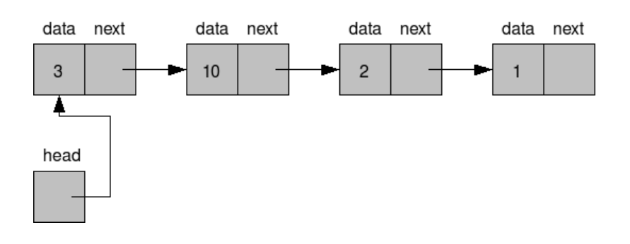
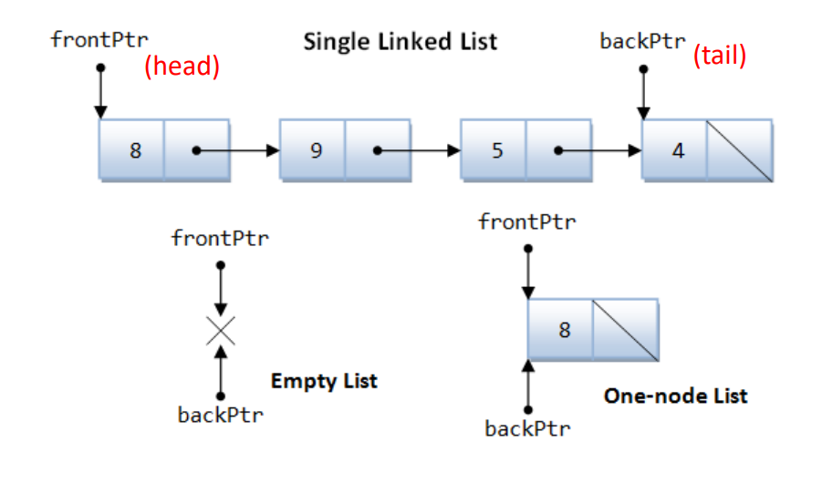

# Linked List (链表)

**链表是一种常见的数据结构，它允许在不连续的存储空间中存储数据，与数组相比，链表在插入和删除操作上具有更高的效率。**

## 1.引言

* 使用数组有什么缺点？
  * 在数组中间插入或删除元素会很麻烦
  * 空间有限，存在溢出风险
* 更好的实现：
  * 链表（Linked list）：元素通过指针被“链”在一起



链表利用结构体的设置，额外开辟出一份内存空间储存指针，而这个指针将**总是**指向下一个节点（当没有下一个节点时，指针值为NULL），一个个节点通过next指针串联，就形成了链表。

## 2.单链表



除了“链表节点”以外，我们通常还需要一个指向链表首个节点的指针（frontPtr），为了更方便地在链表结尾插入元素，我们有时也会需要一个指向链表末尾节点的指针（backPtr）。

下面，让我们来定义链表节点，并设计**初始化、插入、删除、销毁、遍历**等函数。

### 定义链表节点和链表

一个链表节点应当包含**该节点所存储的数据**（亦称为“元素”）和**指向下一个节点的指针**。这里我们假设存储的数据是整数，那么有

```c
typedef struct ListNode {
  int data;
  struct ListNode *next;
} ListNode;
```

则 `ListNode` 就是链表的节点的类型。

一个链表，实际上就是由一个指向其头部节点的指针确定的，同时为了方便我们还可以记录一下当前链表的长度（即链表中有多少个节点）。因此有

```c
typedef struct LinkedList {
  ListNode *headPtr;
  size_t length;
};
```

### 链表初始化

首先我们实现一个函数 `listInit` ，它负责将一个给定的链表初始化为**空链表**。一个空链表的 `headPtr` 应当是 `NULL` ，其 `length` 应当为零。

```c
void listInit(LinkedList *list) {
  list->headPtr = NULL;
  list->length = 0;
}
```

那么，用户（即链表的使用者，当然有可能也是你自己）可以这样创建一个空链表：

```c
LinkedList myList;
listInit(&myList);
```

### 向链表添加元素

我们将实现以下两个函数：

- `void listPushFront(LinkedList *list, int value);` 创建一个节点，其存储的数据为 `value` ，并将该节点插入 `list` 指向的链表的**头部**位置。
- `void listInsertAfter(LinkedList *list, ListNode *pos, int value);` 创建一个节点，其存储的数据为 `value` ，并将该节点插入 `pos` 指向的节点**之后**的位置。 `pos` 指向的节点应当是 `list` 指向的链表中的某个节点。

有了这两个函数，用户就可以向一个链表中添加元素了，例如

```c
LinkedList myList;
listInit(&myList);
listPushFront(&myList, 42); // myList 包含 1 个元素 {42}
ListNode *lastNode = myList.headPtr;
for (int i = 0; i < 5; ++i) {
  listInsertAfter(&myList, lastNode, i * i);
  lastNode = lastNode->next;
}
// myList 包含 6 个元素 {42, 0, 1, 4, 9, 16}
```

首先实现 `listPushFront` ：

```c
void listPushFront(LinkedList *list, int value) {
  ListNode *newNode = malloc(sizeof(ListNode));
  *newNode = (ListNode){.data = value,
                        .next = list->headPtr}; // 新节点的 next 指向头节点
  list->headPtr = newNode; // 将新节点设置为新的头节点
  ++list->length;
}
```

留个心眼，这份实现在 `list` 指向的链表为空时也是正确的：此时 `list->headPtr` 是空指针，那么 `newNode->next` 就是空指针，则函数执行完毕后 `list->headPtr` 指向新创建的节点，而新创建的节点的 `next` 为空指针。

下面我们实现 `listInsertAfter` ：

```c
void listInsertAfter(LinkedList *list, ListNode *pos, int value) {
  assert(pos != NULL); // pos 不应为空

  ListNode *newNode = malloc(sizeof(ListNode));
  *newNode = (ListNode){.data = value,
                        .next = pos->next}; // 新节点的 next 指向 *pos 的下一个节点
  pos->next = newNode; // 将新节点设置为 *pos 的下一个节点
  ++list->length;
}
```

这份实现在 `list` 为空、 `pos` 指向头部或 `pos` 指向尾部这些边界情况下都是正确的，读者可以自行验证。

最后，为什么我们不定义在链表**尾部**插入元素的函数？这是因为我们的链表 `LinkedList` 里没有记录最后一个节点的指针，不能很方便地实现在尾部插入元素。但是用户如果有这一需求，可以自行记录末尾节点的指针，然后将其传给 `listInsertAfter` 便可做到在尾部插入元素。

为什么我们不定义在某个节点**之前**插入元素的函数？这个问题留给读者思考。

### 从链表中删除元素

我们将实现两个函数：

- `void listPopFront(LinkedList *list);` 删除 `list` 指向的链表的**头一个**节点。 `list` 指向的链表必须包含至少一个节点。
- `void listEraseAfter(LinkedList *list, ListNode *pos);` 删除 `pos` 指向的节点的**下一个**节点。 `pos` 指向的节点应当是 `list` 指向的链表中的某个节点。

用户可以这样使用它们：

```c
// 假设 myList 有 6 个元素 {42, 0, 1, 4, 9, 16}
ListNode *p = myList.headPtr; // p 指向 42 所在的节点
listEraseAfter(&myList, p);   // {42, 1, 4, 9, 16}, p 指向 42 所在的节点
p = p->next;                  // p 指向 1 所在的节点
listEraseAfter(&myList, p);   // {42, 1, 9, 16}, p 指向 1 所在的节点
listPopFront(&myList);        // {1, 9, 16}
while (myList.length > 0)
  listPopFront(&myList);    // 依次删除 1, 9, 16
// 现在 myList 是空链表
```

`listPopFront` 的实现：

```c
void listPopFront(LinkedList *list) {
  assert(list->headPtr != NULL); // 头节点应当存在
    
  ListNode *toDelete = list->headPtr;  // toDelete 指向将要被删除的节点
  list->headPtr = list->headPtr->next; // 将第二个节点设为头节点
    
  free(toDelete);
    
  --list->length;
}
```

如果 `list` 仅包含 1 个元素， `listPopFront` 执行完毕后， `list` 会成为空链表吗？请读者自行验证。

`listEraseAfter` 的实现：

```c
void listEraseAfter(LinkedList *list, ListNode *pos) {
  assert(pos != NULL);       // pos 指向的节点应当存在
  assert(pos->next != NULL); // pos 指向的节点的下一个节点也应当存在
    
  ListNode *toDelete = pos->next; // toDelete 指向将要被删除的节点
  pos->next = pos->next->next;    // 将 *pos 的下下个节点设为 *pos 的下一个节点
    
  free(toDelete);
    
  --list->length;
}
```

为什么我们不定义删除一个给定的指针指向的节点的函数？这个问题留给读者思考。

### 销毁一个链表

由于链表的节点都是在由 `malloc` 分配的动态内存上创建的，销毁一个链表时需要释放它的所有节点所占用的内存。我们定义如下函数来做到这一点：

```c
void listDestroy(LinkedList *list) {
  while (list->length > 0)
    listPopFront(list);
}
```

以上是一个简单的实现，它将工作委托给了 `listPopFront` 来完成。

`listDestroy(list)` 是否应该 `free(list)` ？——**不！**比如在下面的使用场景中

```c
LinkedList myList;
listInit(&myList);
// 向 myList 插入了一些元素 ...
// ...
// 现在，调用 listDestroy 来销毁这个链表
listDestroy(&myList);
```

`myList` 根本不是在动态内存上创建的！请务必区分这一点：链表的节点都是在动态内存上创建的，但链表本身（即这个 `LinkedList` 类型的对象）不一定！用户可以自行决定在何种内存上放置它：

```c
LinkedList myGlobalList;
int main(void) {
  listInit(&myGlobalList);
  listDestroy(&myGlobalList);
    
  LinkedList myLocalList;
  listInit(&myLocalList);
  listDestroy(&myLocalList);
  
  LinkedList *myDynamicList = malloc(sizeof(LinkedList));
  listInit(myDynamicList);
  listDestroy(myDynamicList);
  free(myDynamicList); // 如果用户选择在动态内存上创建 LinkedList 对象，用户应该自己记得 free 它
                       // listDestroy 没有义务 free 它
}
```

### 遍历链表节点

**遍历 (traverse)** 一个数据结构，就是按照一定顺序访问该数据结构中的每一个元素。例如遍历一个数组只需要使用类似于下面这样的一个循环：

```c
for (size_t i = 0; i < N; ++i)
  do_something_with(a[i]);
```

对于链表来说，我们只需从第一个节点开始，每次沿着 `next` 指针找到下一个节点：

```c
for (ListNode *cur = myList.headPtr; cur != NULL; cur = cur->next)
  do_something_with(cur->data);
```

作为一个例子，我们实现一个函数来在一个链表中查找一个特定的元素。如果找到了，就返回指向该节点的指针，否则返回空指针。

```c
ListNode *listFind(const LinkedList *list, int value) {
  for (ListNode *cur = list->headPtr; cur != NULL; cur = cur->next)
    if (cur->data == value)
      return cur;
  return NULL;
}
```

## 3.总结

* 单链表的优点：
  * 动态大小
  * 高效的插入和删除操作
* 单链表的缺点：
  * 随机访问效率较低
  * 需要额外的内存存储指针
  * 难以计算链表元素数量（除非额外记录）
  * ……

## 4.参考阅读

[https://zhuanlan.zhihu.com/p/249144171](https://zhuanlan.zhihu.com/p/249144171)
